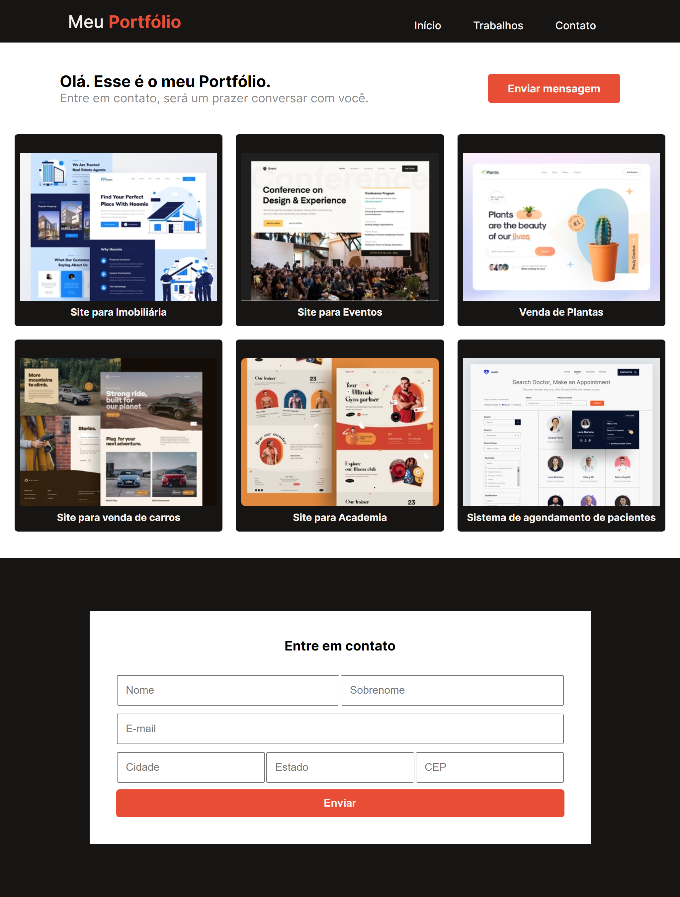
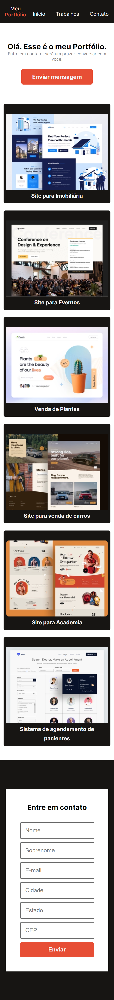

# Programa Explorer da Rocketseat 

- Construindo um site que se adapta em diversas resoluções de tela.

 

Clique [AQUI](https://alineviana.github.io/explorer-classroom-portfolio/) para acessar o projeto

 

> ## 📝 Conceitos estudados
 

- Aplicando responsividade
- Adaptação do site em diversas resoluções de tela
- Unidades de medidas flexíveis (% e rem)

 

> ## 🖥️ Tecnologias
 

- HTML5
- CSS3
- JavaScript